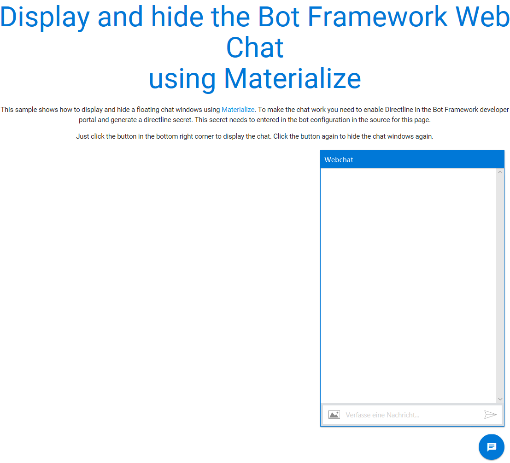

# Bot Framework Floating Web Chat
This sample shows how to display and hide a floating chat windows using [Materialize](http://materializecss.com) and the [Bot Framework Web Chat](https://github.com/Microsoft/BotFramework-WebChat). To make the chat work you need to enable Directline in the [Bot Framework developer portal](https://dev.botframework.com/) and generate a directline secret. This secret needs to be entered in the bot configuration in the source for the [sample page](./index.html).

## Screenshot

   
